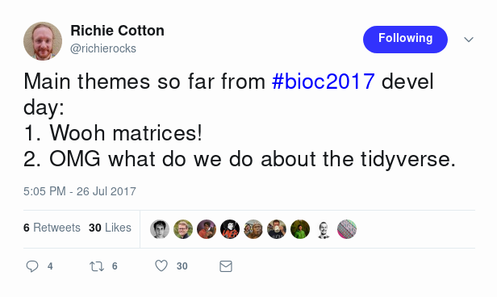
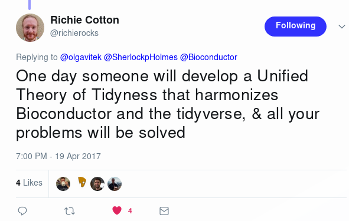
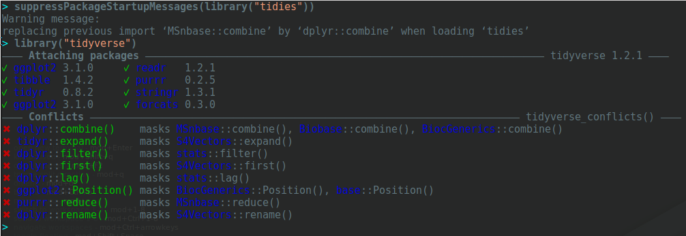
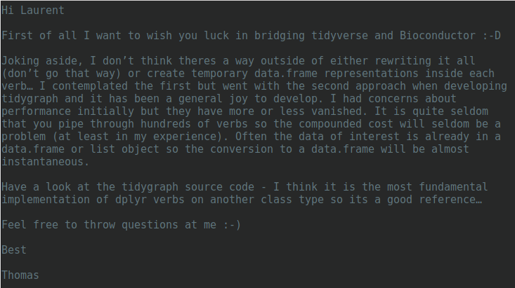
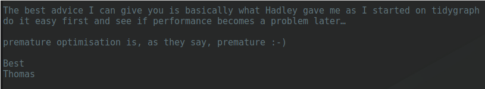

```{r setup, include=FALSE}
options(htmltools.dir.version = FALSE)
```

class: middle
name: cc-by

### Get the slides at [http://bit.ly/tidies-eurobioc18](http://bit.ly/tidies-eurobioc18).

These slides are available under a **creative common
[CC-BY license](http://creativecommons.org/licenses/by/4.0/)**. You are
free to share (copy and redistribute the material in any medium or
format) and adapt (remix, transform, and build upon the material) for
any purpose, even commercially
.


---
class: middle, center, inverse

## Motivation - a tale of two cultures


???

There are numerous complementary views about
- Object-oriented programming (`S3` vs `S4`; `S4` vs `R5` vs `R6`),
- Visualisation (base vs `lattice` vs `ggplot2`)
- Data analysis (base vs `tidyverse`)
- ...

---
class: middle, center

[](https://twitter.com/richierocks/status/890241642334179329)

---
class: middle, center, inverse

## The goal is to ...

---
class: middle

## Use a Bioconductor object in all its glory with the tidyverse tools.

(without *explicitly/manually* converting it from/to a tibble)

---
class: middle, center

[](https://twitter.com/richierocks/status/854756507434573824)


---
class: middle

This talk is about

> *tidy data analysis for eSet-like objects* using the `tidies` package

But see also

- [`plyranges`](http://bioconductor.org/packages/release/bioc/html/plyranges.html)
- [`Organism.dplyr`](http://bioconductor.org/packages/release/bioc/html/Organism.dplyr.html)
- [`biobroom`](https://www.bioconductor.org/packages/release/bioc/html/biobroom.html) (see later)
- and probably more ...

---
class: middle, center


---
class: middle, center, inverse

## How to

---
class: middle

```{r testdata, message = FALSE}
library("MSnbase")
data(msnset)
msnset
```

---
class: middle

```{r labels, message = FALSE}
msnset$group <- c("A", "A", "B", "B")
varLabels(msnset)
fvarLabels(msnset)
```

---
class: middle, center, inverse

## Explicitly coercing ...

---
class: middle

## Extract metadata on the fly (1)

```{r onthefly1}
library("magrittr")
library("tibble")
msnset %>% pData
```

---
class: middle

## Extract metadata on the fly (2)


```{r onthefly2}
msnset %>% fData %>% as_tibble
```
---
class: middle

## Using [biobroom](https://www.bioconductor.org/packages/release/bioc/html/biobroom.html) (sample metadata)

```{r biobroom, message = FALSE}
library("biobroom")
tidy(msnset, addPheno = TRUE)
```

---
class: middle

## Expression and feature data

```{r ms2df, message = FALSE}
mdf <- MSnbase::ms2df(msnset)
tibble::as_tibble(mdf)
```

---
class: middle

## Gather into a long format

```{r gather, message = FALSE}
fv <- fvarLabels(msnset)
lmdf <- tidyr::gather(mdf, sample, exprs, -fv)
tibble::as_tibble(lmdf)
```

Given that this coercion is often useful, it is implemented in `as_tibble,MSnSet`.

---
class: middle, center, inverse

## The [tidies](https://lgatto.github.io/tidies/) package

???

I would argue that none of the solutions demonstrated above are fully
satisfactory. What we want is

- Compose simple functions with the pipe; here we apply the widely
  used `dplyr` functions and `magrittr` `%>%` operator.

- Each of the adapted tidy function to use and return tidy `eSet`
  data.

---

## Select variables

```{r pselect, message = FALSE, warning = FALSE}
library("tidies")
msnset %>%
    select(group) %>%
    pData
```

--

```{r fselect, message = FALSE, warning = FALSE}
msnset %>%
    select(starts_with("Protein")) %>%
    fvarLabels
```

---

```{r select}
msnset %>%
    select(group) %>%
    select(starts_with("Prot"))
```

---
class: middle


## Ordering

```{r order}
msnset %>%
    arrange(desc(group)) %>%
    pData
```

---

## Filtering

```{r filter1}
msnset %>%
    filter(ProteinAccession == "BSA") %>% exprs
```

--

```{r filter2}
msnset %>%
    filter(group == "A") %>% exprs %>% head(n = 3)
```

--

```{r filter3}
msnset %>%
    filter(group == "A") %>%
    filter(ProteinAccession == "BSA") %>% exprs
```

---
class: middle

## Grouping

```{r grouping1}
msnset %>%
    group_by(ProteinAccession) %>% show
```

---
class: middle

```{r grouping2}
msnset %>%
    group_by(ProteinAccession) %>%
    group_by(group) %>%
    show
```

---
## Summarise

```{r summarise1}
msnset %>%
    group_by(group) %>%
    summarise(mean(exprs, na.rm = TRUE)) %>%
    exprs %>%
    head(n = 3)
```

--


```{r summarise2}
msnset %>%
    group_by(ProteinAccession) %>%
    summarise(max(exprs, na.rm = TRUE)) %>%
    exprs %>%
    head(n = 3)
```

---
class: middle

## Summarise (2)

```{r summarise3}
msnset %>%
    filterNA() %>%
    group_by(ProteinAccession) %>%
    summarise(max(exprs)) %>%
    group_by(group) %>%
    summarise(mean(exprs)) %>%
    filter(ProteinAccession %in% c('ENO', 'BSA')) %>%
    exprs
```

---
class: middle

## To finish on a ~~positive~~ technical note




---
class: middle
name: laurent-gatto

.left-col-50[

### Laurent Gatto
<i class="fas fa-flask"></i>&nbsp;[Computational Biology Group](https://lgatto.github.io/cbio-lab/)<br />
<i class="fas fa-map-marker-alt"></i>&nbsp;de Duve Institute, UCLouvain<br />
<i class="fas fa-envelope"></i>&nbsp;laurent.gatto@uclouvain.be<br />
<i class="fas fa-home"></i>&nbsp;https://lgatto.github.io<br />
<i class="fab fa-twitter"></i>&nbsp;[@lgatto](https://twitter.com/lgatt0/)<br />
<i class="fab fa-github"></i>&nbsp;[lgatto](https://github.com/lgatto/)<br />
&nbsp;[0000-0002-1520-2268](https://orcid.org/0000-0002-1520-2268)<br />
&nbsp;[lgatto](https://keybase.io/lgatto)<br />
&nbsp;[Google scholar](https://scholar.google.co.uk/citations?user=k5DrB74AAAAJ&hl=en)<br />
&nbsp;[Impact story](https://profiles.impactstory.org/u/0000-0002-1520-2268)<br />
<i class="fas fa-pencil-alt"></i>&nbsp;[dissem.in](https://dissem.in/r/6231/laurent-gatto)<br />
<!-- <i class="fab fa-linkedin"></i>&nbsp;https://www.linkedin.com/in/lgatto/<br /> -->
]

.rigth-col-50[

**Acknowledgements**: Thomas Lin Pedersen
([thomasp85](https://twitter.com/thomasp85/)) for early advice.


## Thank you for your attention

<hr/>


<br/>
<br/>
<br/>
<br/>
<br/>

### slides <br/> [http://bit.ly/tidies-eurobioc18](https://raw.githack.com/lgatto/2018_12_07_EuroBioc18_Munich/master/tidies-eurobioc18.html)
### www  <br/> [https://lgatto.github.io/tidies/](https://lgatto.github.io/tidies/)

]


---
class: middle, center, inverse

## (Nothing fancy) under the hood

---
class: middle

## Re: S4[MSnSet]-aware dplyr



---
class: middle

## Premature optimisation is ...


